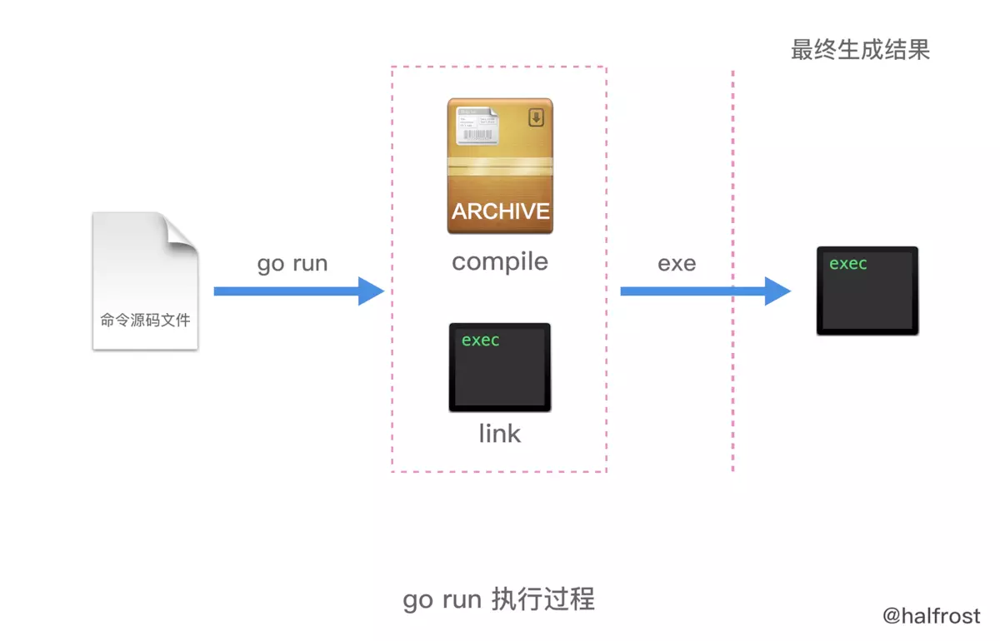

# go语言之旅

## go 语言之旅

## 安装

### 安装 vscode 插件

export GO111MODULE=on export GOPROXY=[https://goproxy.cn](https://goproxy.cn)

Installing github.com/mdempsky/gocode SUCCEEDED Installing github.com/uudashr/gopkgs/cmd/gopkgs SUCCEEDED Installing github.com/ramya-rao-a/go-outline SUCCEEDED Installing github.com/acroca/go-symbols SUCCEEDED Installing golang.org/x/tools/cmd/guru SUCCEEDED Installing golang.org/x/tools/cmd/gorename SUCCEEDED Installing github.com/cweill/gotests/... SUCCEEDED Installing github.com/fatih/gomodifytags SUCCEEDED Installing github.com/josharian/impl SUCCEEDED Installing github.com/davidrjenni/reftools/cmd/fillstruct SUCCEEDED Installing github.com/haya14busa/goplay/cmd/goplay SUCCEEDED Installing github.com/godoctor/godoctor SUCCEEDED Installing github.com/go-delve/delve/cmd/dlv SUCCEEDED Installing github.com/stamblerre/gocode FAILED Installing github.com/rogpeppe/godef FAILED Installing golang.org/x/lint/golint FAILED

### Hello world

```text
package main
import "fmt"

func main() {
    fmt.Println(“Hello, Go!")
}
```

由上面一个简单的程序可见，Go 程序的基础组成有一下几个部分组成

* 包声明
* 引入包
* 函数
* 语句&表达式
* 注释

### 执行 Go 程序

将上面的代码保存为 hello.go, 然后再命令行输入

```text
go build hello.go
```

那么他的编译执行过程是怎样的呢：

1.Go run

在命令行执行， `go run -n helloworld.go`

```text
cjf ~/LeetCode_Go/helloworld/src/me $  go run -n helloworld.go

#
# command-line-arguments
#

mkdir -p $WORK/command-line-arguments/_obj/
mkdir -p $WORK/command-line-arguments/_obj/exe/
cd /Users/YDZ/LeetCode_Go/helloworld/src/me
/usr/local/Cellar/go/1.8.3/libexec/pkg/tool/darwin_amd64/compile -o $WORK/command-line-arguments.a -trimpath $WORK -p main -complete -buildid 2841ae50ca62b7a3671974e64d76e198a2155ee7 -D _/Users/YDZ/LeetCode_Go/helloworld/src/me -I $WORK -pack ./helloworld.go
cd .
/usr/local/Cellar/go/1.8.3/libexec/pkg/tool/darwin_amd64/link -o $WORK/command-line-arguments/_obj/exe/helloworld -L $WORK -w -extld=clang -buildmode=exe -buildid=2841ae50ca62b7a3671974e64d76e198a2155ee7 $WORK/command-line-arguments.a
$WORK/command-line-arguments/_obj/exe/helloworld
```

可以发现它其实干了 5 件事情

* 建立两个临时文件夹\_obj 和 exe
* 执行 compile 命令
* 然后链接生成归档文件`command-line-arguments.a` 和放在 ext 目录下的最终可执行文件 helloworld

总结一下，如下图



go run 命令在第二次执行的时候，如果发现导入的代码包没有发生变化，那么 go run 不会再次编译这个导入的代码包。直接静态链接进来。

