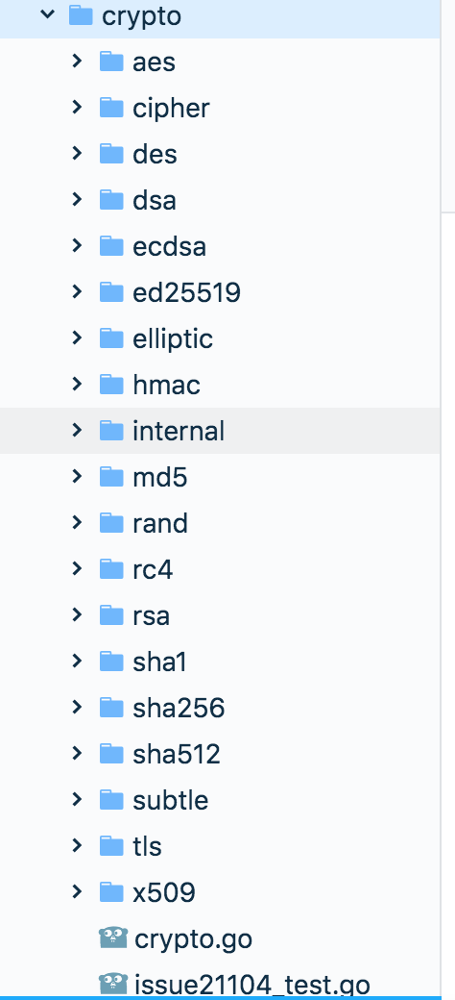

# 包package

在Go语言中，所有的程序语言都会被组织称若干个文件，每组文件成文一个包。每个包是最小的复用单元，供其他项目引用。我们看下标准库os的包的组织： 



这个目录包含一些列的文件夹和以.go为拓展名的文件。

## 2 包名惯例

给包命名的惯例是使用包所在的目录的名字，这样用户导入时就能清晰的知道包，以上面的crypto/md5包为例,所有的md5目录下的文件，都属于md5包。包名应当简洁、清晰且全是小写，这样便于标准开发。

需要注意的是：

* 包的名字不必相同，因为包的路径不同就可以区分
* 一般情况下，包导入后会使用你的包名作为默认名字，不过这个也可以修改，这个我们在[后面](https://github.com/dajuguan/go/tree/bcc387ded743984225e62b39a0878f32b840e4c5/2%20包名惯例/README.md)会有说明。

## main包

在go语言中有一种特殊的包叫做main包，它是程序的入口文件，里面必须包含一个main\(\)函数，go语言会试图把它打包成可执行的二进制函数。

如果包名被改为main之外，比如hello,编译器就会把它认为只是一个包，运行

```text
package main
import "fmt"
func main(){
    fmt.Println("Hello, Go!")
}
```

`go run hello.go` 就会报错。

## 引入包

我们已经知道了代码是如何组织到包里，那么下面看看如何导入这些包，导入单个包比较简单`import "fmt"`; import语句会告诉编译器去哪里寻找包。如果需要导入多个包，可以一条条引入，但是习惯是将import语句包装

```text
import (
    "fmt"
    "crypto/md5"
)
```

那么编译器到哪里查找包，又是按什么顺序的呢？ 举个栗子，查找crypto/md5包,如果go安装在/usr/local/Cellar/go@1.9/1.9.7/,并且GOPATH环境变量在/home/Documents/gopath:/home/libraries,编译器会按照如下的顺序查找md5包

```text
/usr/local/Cellar/go@1.9/1.9.7/libexec/src/crypto/md5
/home/Documents/gopath/src/crypto/md5
/home/libraries/src/crypto/md5
```

编译器先查找go的安装目录，再逐个查找GOPATH环境变量里的目录一旦编译器找到一个满足要求的包，就停止查找。

如果遍历上述的所有目录，还没有找到，那么执行时编译器就会报错。后面会介绍如果通过go get命令来修正这个错误。

## 远程第三方库导入

以github的库为例

```text
import "github.com/spf13/viper"
```

编译程序时,编译器会在`$GOPATH/github.com/spf13/viper`目录寻找这个包。事实上，这个导入路径包含一个URL，指向Github上的相应代码库，如果在本地GOPATH目录没有找到这个包，那么可以使用go get命令获取包，并把包的源代码保存在GOPATH指向的与URL路径匹配的本地路径里。

## 命名导入-解决包重名问题

如果导入的包具有相同的名字，比如导入自己项目的mylib/fmt包和标准库的fmt包，那么会报错

```text
fmt redeclared as imported package name
```

这时，可以通过**命名导入** 的方式来导入，import给出的包路径左侧定义一个新的名字，比如:

```text
package main

import (
   "fmt"
   myfmt "mylib/fmt"
)
func main(){
   fmt.Println("Hello, Go!")
   myfmt.Print()
}
```

同时，如果你导入了一个不在代码中使用的包时，go也会报错。这时可以使用空白标识符\_来重命名这个导入包，后面会降到这个特性

## 导出包

在go语言中，函数以大写开头的都可以被外部包调用，否则只能在包内部调用,比如

```text
//文件位置：
//$GOPATH/src/test/test.go
package test
import "fmt"
func Say(){
    fmt.Println("Hi,I am exported")
}
```

```text
//文件位置：
//$GOPATH/hello.go
package main

import "test"
func main(){
   test.Say()
}
```

运行`go run hello.go`,会输出`Hi,I am exported`.

## init函数

每个包可以包含 _多个_ init函数，这些函数会在程序执行开始的时候被调用，所有的init函数都会在main函数之前被执行。init函数在初始化变量、设置包或者其他程序运行前的引导工作很有作用。 比如

```text
package main

import "fmt"
func main(){
   fmt.Println("I am the last..")
}

func init(){
   fmt.Println("I am the first!")
}
```

