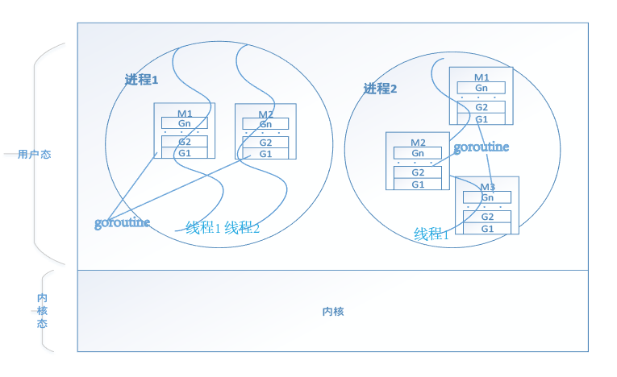

# 协程与通信

## 协程\(goroutine\)与通道\(channel\)

## 并发与并行

并发指的是同一时间处理多件事情，这些事情一般是独立的，一般是抢占式的，主要通过提高单个CPU的利用率； 并行指的是同一时间同时处理一件或多件事情，一般而言这些事情是一个大任务的并列子事情，一般是非抢占式的，需要多核CPU的支持。

Go语言在语言层面支持了并发，通过goroutine提供一种用户态线程，我们一般把它成为**协程**。协程在某种程度上可以看做是轻量级线程，它由应用程序而非操作系统来创建和管理，使用开销较低（一般为4K）, 程序员可以轻松的创建很多goroutine，并且go语言会负责保证尽可能公平地调度使用CPU。

调度器主要分为4个部分，前三个定义在runtime.h中，Sched定义在proc.c中:

* M\(work thread\):OS Thread，由os管理
* G\(goroutine\):goroutine实体，包含调用栈，重要的调度信息，比如channel等
* P\(processor\):衔接M和G的调度上下文，负责等待执行的G和M的对接，通过GOMAXPROCS\(\)设置P的数量，来决定有多少个goroutine可以并发。
* Sched:负责调度

在Go中，OS Thread和User Thread之间是多堆垛的关系，使得多个goroutine可以再多个OS Threads是执行。

* 即保证了上下文切换的效率
* 又能利用多核的优势

每个goroutine都会被特定的P维护，每个P会把自己所维护的所有的goroutine放到一个G队列中，然后M每次挑选一个有效P，然后执行其中的goroutine。

默认情况下，P的数量和M一样。所以当我们创建多个goroutine时，他们会被分配到不同的P中，而M不唯一，当M随机挑选P是，也就等于随机挑选了goroutine来执行。



所以多个goroutine之间的执行顺序是不确定的，因为gorouine进入的P是不确定的，而P被执行的顺序也是不确定的。

## goroutine

在Go语言中，只需要在代码块前面加上关键字go，即可创建一个goroutine。

```text
package main
import (
   ."fmt"
   "time"
)

func main(){
   for i := 0; i < 10; i++ {
      go func(i int){
         Println(i)
      }(i)
   }
   time.Sleep(time.Second*1)
}
```

可以运行看到输出的结果为

```text
1
3
8
2
6
0
9
7
5
4
```

并且每次的顺序是随机的。 在这里读者们注意到了为什么要使用time.Sleep，这是因为在Go中，goroutine和main函数使用的不是一个协程，他们之间是并发的关系，谁都有可能发生，并且main函数不会等待其他goroutine运行完才推出，main函数主体运行完就会退出。如果不加这一句，可能得不到输出。但是加上这一句我们就一定能得到正确的输出吗？答案是否的的，因为每个goroutine实际等待的时间我们不能预知，如果有外界的因素干扰，有可能等1秒，但是其他的goroutine被阻塞了，还是得不到正确的输出结果。

所以这个时候就需要锁，来进行显式的同步。

## 通道（channel）

Go语言中不同的goroutine之间的通信可以通过channel来实现。Go语言奉行通过channel的通信来共享内存，而不是共享内存来通信。

channel是协程之间的通信方式，像函数传参那样可以传递类型int、指针等类型。

### channel的创建

* channel是类型相关的，一种channel只能传递一种类型，需要在声明channel时指定；
* channel可以指定缓冲区大小，默认是无缓冲的，也就是channle的存消息和取消息都是阻塞的
* channel的类型可以是send,receive和同时send与reveive

```text
   send_chan := make(chan<- int)   //只发送
   receive_chan := make(<-chan int)  //只接收
   send_receive_chan := make(chan int) //发送与接收
```

一般而言只发送或者接收用于函数参数传递中。 举个实际例子，比如一个go协程接收很多输入数据，然后有很多goroutine来处理这些数据，可以采用通道来实现：

```text
package main
import (
   ."fmt"
   "math/rand"
   "time"
)

type Worker struct{
   id int
}

func (w Worker) process(c <-chan int){
   for {
      data := <-c
      Printf("Worker %d Got data:%d\n", w.id, data)
   }
}

func main(){
   c := make(chan int) //发送与接受
   //4个处理线程
   for i :=0; i < 4 ; i++ {
      w := Worker{id:i}
      go w.process(c)
   }
   //数据输入线程
   for {
      c <- rand.Int()
      time.Sleep(time.Millisecond * 60)
   }
}
```

> 虽然我们并不知道哪一个Worker线程会接收数据，但是Go语言确保通道是唯一共享的状态，可以通过通道，安全地并发的接受数据；并且在任意时刻，只有一个go协程可以访问特定数据。

### 有缓冲区的通道

在无缓冲区的通道，数据接收或者发送没有准备好，通道就会阻塞；但是在很多情况，我们希望先把数据缓存起来，然后等待客户端去处理，带缓冲区的通道就可以确保通道有可用缓冲区时，通道就不会阻塞。

我们修改下上面的例子，我们创建一个100长度的缓冲区，通过time.Sleep来模拟客户端处理能力不足，同时用len来查看通道的长度：

```text
package main
import (
   ."fmt"
   "math/rand"
   "time"
)

type Worker struct{
   id int
}

func (w Worker) process(c <-chan int){
   for {
      data := <-c
      Printf("Worker %d Got data:%d\n", w.id, data)
      time.Sleep(time.Millisecond *1000)
   }
}

func main(){
   c := make(chan int, 100) //发送与接受
   //4个处理线程
   for i :=0; i < 4 ; i++ {
      w := Worker{id:i}
      go w.process(c)
   }
   //数据输入线程
   for {
      c <- rand.Int()
      Println(len(c))
      time.Sleep(time.Millisecond * 60)
   }
}
```

```text
94
95
96
97
98
99
Worker 1 Got data:1460320609597786623
99
Worker 2 Got data:5600924393587988459
99
Worker 0 Got data:8995016276575641803
99
Worker 3 Got data:732830328053361739
99
100
100
Worker 1 Got data:5486140987150761883
Worker 2 Got data:545291762129038907
100
Worker 0 Got data:6382800227808658932
100
Worker 3 Got data:2781055864473387780
100
Worker 1 Got data:1598098976185383115
100
Worker 2 Got data:4990765271833742716
100
100
Worker 0 Got data:5018949295715050020
Worker 3 Got data:2568779411109623071
100
Worker 1 Got data:3902890183311134652
100
Worker 2 Got data:4893789450120281907
100
Worker 0 Got data:2338498362660772719
100
Worker 3 Got data:2601737961087659062
100
Worker 1 Got data:7273596521315663110
100
Worker 2 Got data:3337066551442961397
100
Worker 0 Got data:8121576815539813105
100
100
Worker 3 Got data:2740376916591569721
Worker 1 Got data:8249030965139585917
100
Worker 2 Got data:898860202204764712
100
Worker 0 Got data:9010467728050264449
100
Worker 3 Got data:685213522303989579
100
Worker 1 Got data:2050257992909156333
100
Worker 2 Got data:6281838661429879825
100
Worker 0 Got data:2227583514184312746
100
100
Worker 3 Got data:2873287401706343734
Worker 1 Got data:8603989663476771718
100
Worker 2 Got data:6842348953158377901
100
```

我们会发现缓冲区不断加大，同时缓冲区被填满时，通道被阻塞，只能等待客户端处理完，才能继续发送下一个数据。

